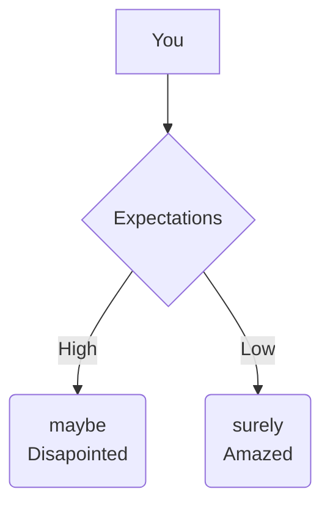

# Django_DevOps

## Intro

Welcome to the Documentation of my DevOps/GitHub/Jira Playground :v:

## Which tools have been used

- :fontawesome-brands-github: [GitHub-Repository](https://github.com/mauwii/django_devops)
- :material-microsoft-azure-devops: [Azure-Pipelines](https://dev.azure.com/mauwiidev/django_gh)
- :fontawesome-brands-atlassian: [Jira](https://mauwii.atlassian.net/jira/software/c/projects/DG/issues)
- :material-file-document: [MkDocs-Material](https://squidfunk.github.io/mkdocs-material/)

## Expectations

You should try to keep your expectations low, then you will be amazed even more while finding out about the things I am just finding out myself with this playground.

