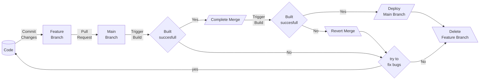

```mermaid
graph LR
  Code[(Code)] -- Commit<br>Changes --> FeatureBranch[Feature<br>Branch];
  FeatureBranch[Feature<br>Branch] -- Pull<br>Request --> MainBranch[Main<br>Branch];
  MainBranch -- Trigger<br>Build --> CheckFeature{Built<br>succesfull};
  CheckFeature -- Yes --> CompleteMerge[/Complete Merge/];
  CompleteMerge -- Trigger<br>Build --> CheckMain{Built<br>succesfull};
  CheckMain -- Yes --> DeployMain[/Deploy<br>Main Branch/];
  DeployMain --> DeleteFeature[\Delete<br>Feature Branch\];
  CheckMain -- No --> RevertMerge[\Revert Merge\];
  RevertMerge[\Revert Merge\] --> TryBugFix{try to<br>fix bugs};
  TryBugFix -- No --> DeleteFeature;
  CheckFeature -- No --> TryBugFix;
  TryBugFix -- yes --> Code;
```
