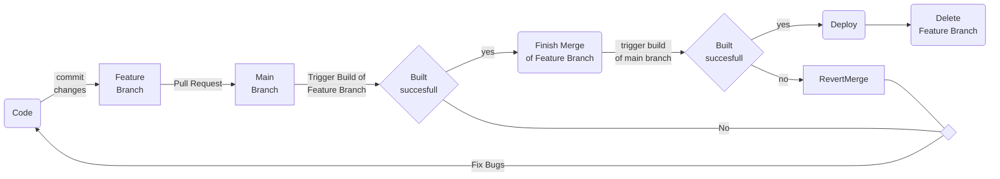

```mermaid
graph LR;
  Code(Code) -->|commit<br>changes| FeatureBranch[Feature<br>Branch]
  FeatureBranch--> |Pull Request| MainBranch[Main<br>Branch]
  MainBranch --> |Trigger Build of<br>Feature Branch| CheckFeature{Built<br>succesfull}
  CheckFeature --> |yes| FinishMerge(Finish Merge)
  CheckFeature --- |No| cross{ }
  FinishMerge(Finish Merge<br>of Feature Branch) -->| trigger build<br>of main branch | CheckMain{Built<br>succesfull}
  CheckMain --> |yes| Deploy(Deploy)
  CheckMain --> | no | RevertMerge
  Deploy --> DeleteBranch(Delete<br>Feature Branch)
  RevertMerge --- cross
  cross --> |Fix Bugs| Code
```
