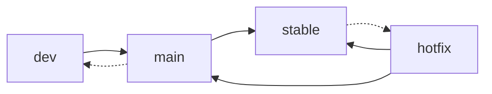
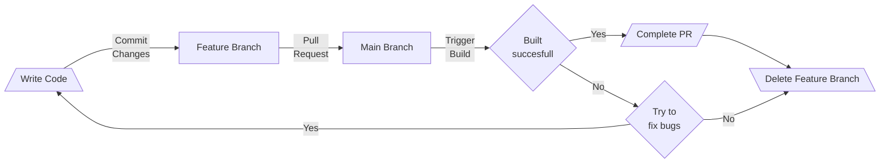
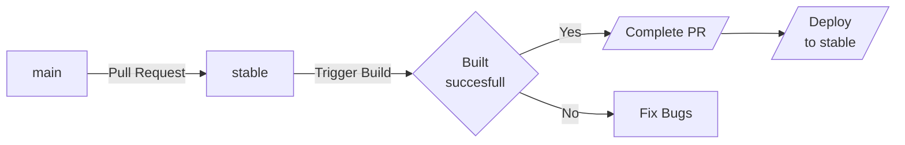

In this Section you will find Informations related to the Workflow of the Repository.

## Branching Strategy

### Table

| Branch name            |  instance  |  Create From   |            accept PR from            | Branch protection rules / other Info                                                                                       |
| :--------------------- | :--------: | :------------: | :----------------------------------: | :------------------------------------------------------------------------------------------------------------------------- |
| <br>main               |  <br>dev   |  <br>git init  | feature/\* <br>issue/\*<br>hotfix/\* | Require linear history<br>Require status checks to pass before merging<br>Require branches to be up to date before merging |
| stable                 | Production |  Pull-Request  |          main<br>hotfix/\*           |                                                                                                                            |
| feature/\*<br>issue/\* |            |  Head of main  |                  -                   | must be up to date with main for PR                                                                                        |
| hotfix/*               |            | Head of stable |                  -                   |

Main branch is used as the working branch. To develope new features, create branch from main branch called `feature/<jira-id>/<feature-name>` for new features, or `issue/<jira-id>/<issue-name>` when solving a issue. When development of the feature or issue is done, create a pull request to merge it into main branch.

When time has come for a release, create a pull request to merge main into stable.

For bigger problems, like f.E. a zero-day, create a branch from stable and name it `hotfix/<jira-id>` and try to fix the issue asap. When done, merge this hotfix back into stable as well as main.

### Diagrams

#### Small



#### Detailed

##### From dev to main



##### From main to stable

incomplete



#### Commit flow example

``` mermaid
gitGraph
  commit
  branch stable
  branch feature-1
  checkout feature-1
  commit
  checkout main
  merge feature-1
  checkout stable
  merge main
  checkout main
  branch feature-2
  checkout feature-2
  commit
  checkout main
  branch feature-3
  checkout feature-3
  commit
  checkout main
  merge feature-2
  checkout stable
  branch hotfix-1
  checkout hotfix-1
  commit
  checkout stable
  merge hotfix-1
  checkout main
  merge hotfix-1
  checkout feature-3
  commit
  checkout main
  merge feature-3
  checkout stable
  merge main
```

### Automation

Of course the approach is to have as much automated as possible, which also means that pull-request should in the end get tested and resolved by themselves (...or the help of Azure-Pipelines :material-microsoft-azure-devops:)
