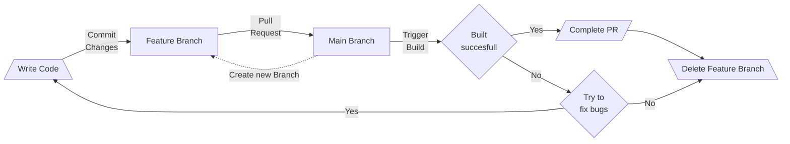
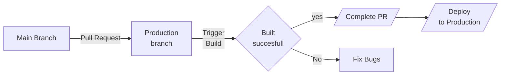

In this Section you will find Informations related to the Workflow of the Repository.

## Branching Strategy

### Table

|    instance    | Branch name            |          accept PR from           | Create From        | other infos                                                                                                                |
| :------------: | :--------------------- | :-------------------------------: | :----------------- | :------------------------------------------------------------------------------------------------------------------------- |
| working branch | main                   | feature/\* <br>issue/\*<br>hotfix | Pull-Request       | Require linear history<br>Require status checks to pass before merging<br>Require branches to be up to date before merging |
|      Dev       | feature/\*<br>issue/\* |               main                | Head of main       | must be up to date with main for PR                                                                                        |
|     hotfix     | hotfix/*               |                 -                 | Head of Production |
|   Production   | Production             |          main<br>hotfix           | Pull-Request       |

Main branch is used as the working branch. To develope new features, create branch from main branch called `feature/<jira-id>-<feature-name>` for new features, or `issue/<jira-id>` when solving a issue. When development of the feature or issue is done, merge it back into the main branch with a pull request.

When time has come for a release, create a pull request to merge main into Production.

For bigger problems, like f.E. a zero-day, create a branch from Production and name it `hotfix/<jira-id>` and try to fix the issue asap. When done, merge this hotfix back into stable as well as into main.

### Diagrams

#### Small

````mermaid
graph LR
    dev --> main;
    main -.-> dev;
    main --> production;
    production -.-> hotfix;
    hotfix --> production & main;
````

#### Detailed

##### From Dev to Main



##### From Main to Prod

incomplete



#### GitGraph example

``` mermaid
gitGraph
    commit
    branch production
    checkout production
    checkout main
    branch feature-1
    checkout feature-1
    commit
    checkout main
    merge feature-1
    checkout production
    merge main
    checkout main
    branch feature-2
    checkout feature-2
    commit
    checkout main
    branch feature-3
    checkout feature-3
    commit
    commit
    checkout feature-2
    commit
    checkout main
    merge feature-2
    checkout production
    merge main
    checkout feature-3
    commit
    commit
    checkout main
    checkout production
    branch hotfix-1
    commit
    checkout production
    merge hotfix-1
    checkout main
    merge hotfix-1
    checkout main
    checkout feature-3
    merge main
    checkout main
    merge feature-3
    checkout production
    merge main
```

### Automation

Of course the approach is to have as much automated as possible, which also means that pull-request should in the end get tested and resolved by themselves (...or the help of Azure-Pipelines :material-microsoft-azure-devops:)
