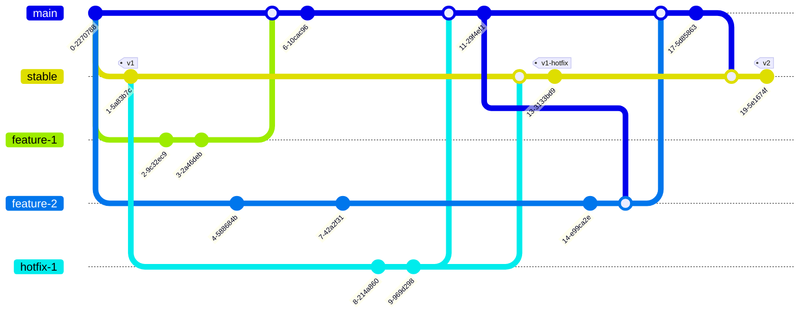

In this Section you will find Informations related to the Repository, like a

### Branching Strategy

#### Table

|     instance     | Branch name            |          accept PR from           | Create From    | other infos                                                                                                                |
| :--------------: | :--------------------- | :-------------------------------: | :------------- | :------------------------------------------------------------------------------------------------------------------------- |
| feature-branches | feature/\*<br>issue/\* |               main                | Head of main   | must be up to date with main for PR                                                                                        |
|  working branch  | main                   | feature/\* <br>issue/\*<br>hotfix | Pull-Request   | Require linear history<br>Require status checks to pass before merging<br>Require branches to be up to date before merging |
|      hotfix      | hotfix/*               |                 -                 | Head of stable |
|     release      | stable                 |          main<br>hotfix           | Pull-Request   |

Main branch is used as the working branch. To develope new features, create branch from main branch called `feature/<jira-id>-<feature-name>` for new features, or `issue/<jira-id>` when solving a issue. When development of the feature or issue is done, merge it back into the main branch with a pull request.

When time has come for a release, create a pull request to merge main into stable.

For bigger problems, like f.E. a zero-day, create a branch from stable and name it `hotfix/<jira-id>` and try to fix the issue asap. When done, merge this hotfix back into stable as well as into main.

#### Diagram

##### Small

````mermaid
graph LR
    dev --> main;
    main -.-> dev;
    main --> stable;
    stable -.-> hotfix;
    hotfix --> stable & main;
````

##### Detailed


A more detailed Workflow-Diagram is located in the next

#### GitGraph example



#### Automation

Of course the approach is to have as much automated as possible, which also means that pull-request should in the end get tested and resolved by themselves (...or the help of Azure-Pipelines :material-microsoft-azure-devops:)
